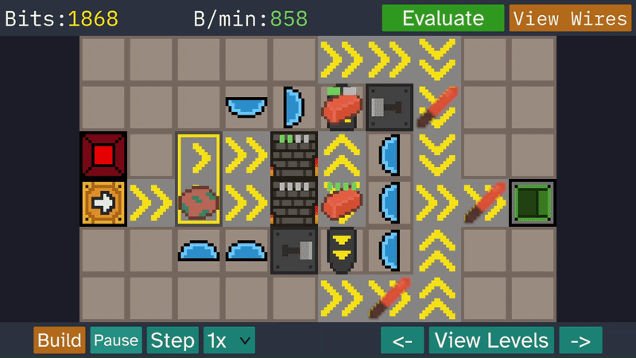

# CodeSmith

**An educational factory automation puzzle game built with Unity and C#.**

CodeSmith is a game-based educational tool designed to introduce beginners to computational thinking and programming-related problem-solving without requiring them to write code.

Players construct automated factories by placing components and connecting wires. Each level presents a production challenge that encourages experimentation, debugging, and optimisation.

**[Play CodeSmith in your browser](https://louiscreser.github.io/CodeSmith/)**

> **Note:** Progress does not currently persist between sessions in the browser version. To retain saved progress, run the game locally.

## Gameplay

CodeSmith challenges players to design factory floors that produce specific items and meet production targets.

Players can:

- **Build factories:** Place and rotate components such as conveyors, furnaces, and anvils on a grid.
- **Create logic circuits:** Connect sensors to signal-controlled components using wires to control factory behaviour.
- **Run and debug:** Execute the factory simulation, identify problems, and modify the design to resolve them.
- **Optimise production:** Improve layouts to increase production rates and income per minute.
- **Progress through levels:** Earn currency, purchase components, unlock levels, and access instructional manuals.

**Important:** Purchase instructional manuals using in-game currency to learn about game mechanics and components. Click a manual once to purchase it, then click it again to open it.

## Getting Started

### Play Online

The browser version is available to try on GitHub Pages:

**https://louiscreser.github.io/CodeSmith/**

### Run Locally

To run the Unity project locally:

1. Install [Unity Hub](https://unity.com/download).
2. Install **Unity 6000.2.12f1**.
3. Clone this repository:

   ```bash
   git clone https://github.com/louiscreser/CodeSmith.git
   ```

4. Open the cloned project through Unity Hub.
5. Open the game's starting scene and enter Play mode.

Running the game locally enables persistent save data.

## Technical Overview

CodeSmith is developed in **Unity and C#**, with a custom grid-based factory simulation.

### Simulation

The simulation uses a deterministic, tick-based system. On each tick, components generate intents describing their proposed actions, such as moving, spawning, processing, or consuming items.

The simulation processes these intents centrally, allowing it to validate interactions, detect movement conflicts, and update the factory state in a controlled order.

Logic signals propagate through directional wire connections, enabling components to react to buttons, sensors, and other signal sources.

### Architecture

The project separates simulation rules, player interaction, UI presentation, and persistent progression into distinct systems.

| System | Responsibility |
|---|---|
| `FactorySimulation` | Processes simulation ticks, component intents, item movement, collisions, and logic propagation. |
| `FactorySimulationRunner` | Connects the simulation to Unity and updates the visual representation of the factory. |
| `TileGrid` | Manages the grid, component placement, and wire layout. |
| `PlacementController` | Handles component selection, placement previews, rotation, and movement. |
| `PlayerData` | Manages player currency, unlocks, stored components, and level progress. |
| `SaveSystem` | Serialises and deserialises persistent player data using JSON. |

Component, item, and level definitions use Unity ScriptableObjects to keep game data separate from runtime behaviour.

## Saving and Progress

CodeSmith stores player progress locally using JSON.

Saved information includes player currency, level progression, stored components, current factory layouts, and best successful layouts.

## Project Context

CodeSmith was developed as a final-year university project exploring how factory automation gameplay can introduce programming-related problem-solving concepts to beginners. Rather than teaching programming syntax directly, the game encourages players to explore sequencing, conditional logic, debugging, and optimisation by designing and refining visual production systems.


